#  Reto dos: Elementos de navegacion
 Identifica los elementos de navegación en los siguientes sites:

*  **Breather**
*  **Github**
*  **Medium**

## Breather
>[Breather](https://breather.com) es una compañia que facilita transacciones entre consumidores y gente que renta espacios para vivir. La compañia se promueve a si misma como el camino para encontrar un ambiente para descansar fuera de tu casa u oficina. The Next Web se refiere a ella como "El uber de los espacios de trabajo privado".

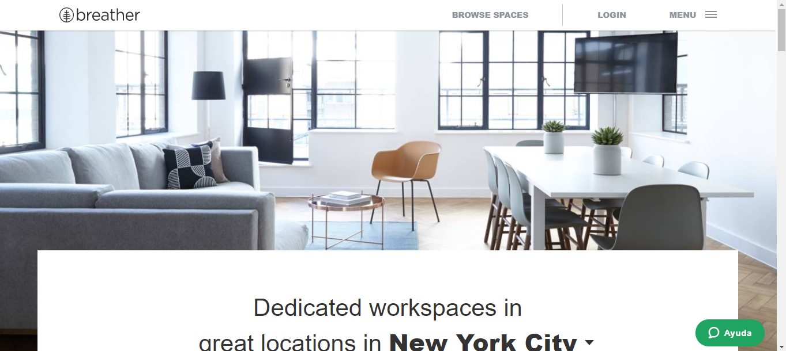
--------------------------------------------------------------------------------------------------------------------------------------------
--------------------------------------------------------------------------------------------------------------------------------------------

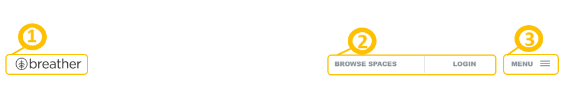
### Navegacion Global
1. **Identificacion del sitio.**
2. **Utilidades.**
3. **Secciones(Barra de menu).**

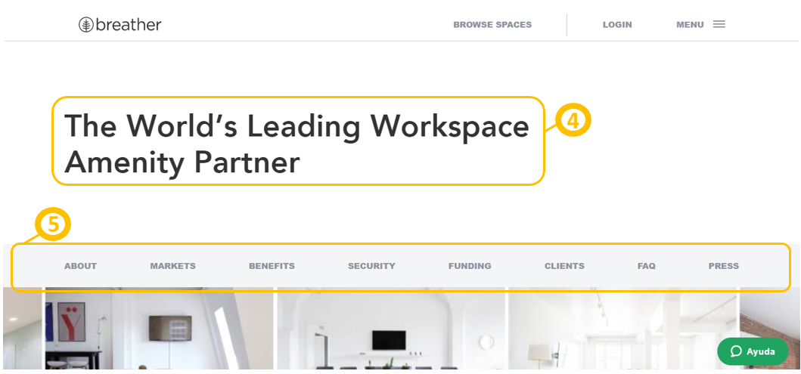

4. **Nombre de la pagina.**
5. **Navegacion local.**

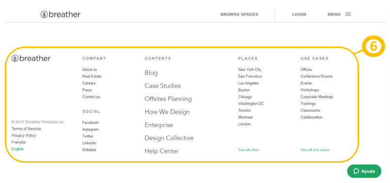

6. **Navegacion de pie de pagina**

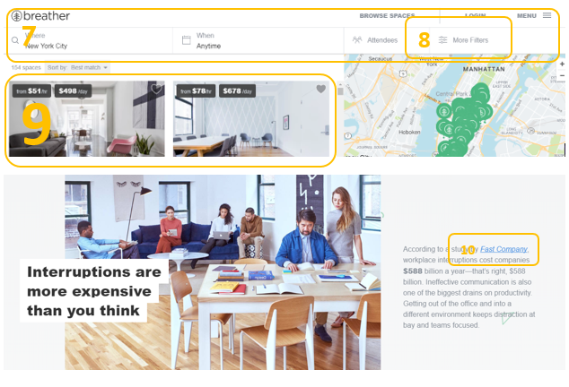

7. **Navegacion Local**
8. **Navegacion Filtrada**
9. **Navegacion contextual**
10. Navegacion Lineal.**

## GitHub
>[GitHub](https://github.com/) es un servicio de alojamiento de repositorio de control de versiones Git basado en la web. Se usa principalmente para código de computadora. Ofrece todas las funciones de control de versiones distribuidas y administración de código fuente (SCM) de Git, además de agregar sus propias características. Proporciona control de acceso y varias funciones de colaboración, como seguimiento de errores, solicitudes de funciones, gestión de tareas y wikis para cada proyecto.

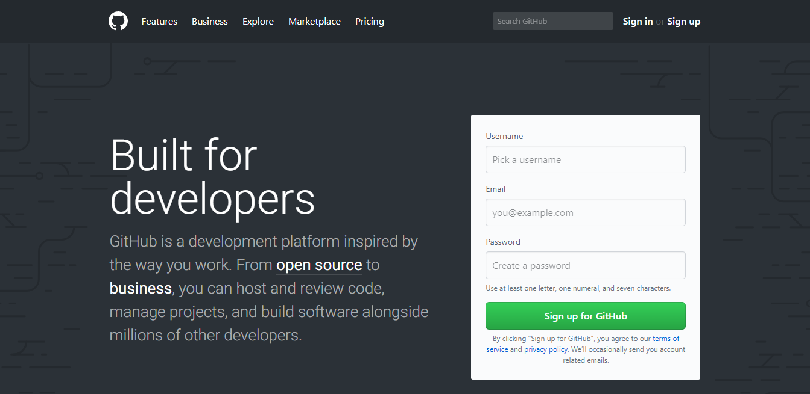
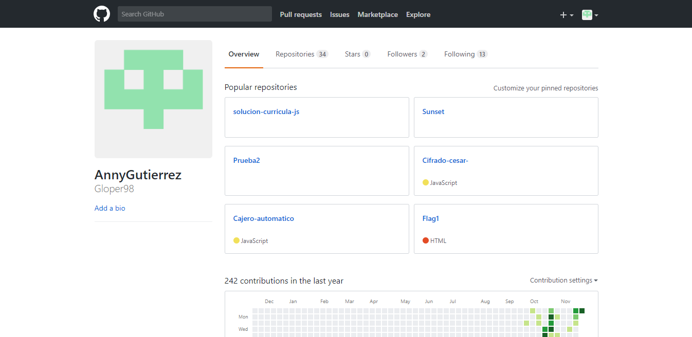
------------------------------------------------------------------------------------------------------------------------------------------

1. **Identificacion del sitio.**
2. **Secciones(Barra de menu).**
3. **Utilidades.**

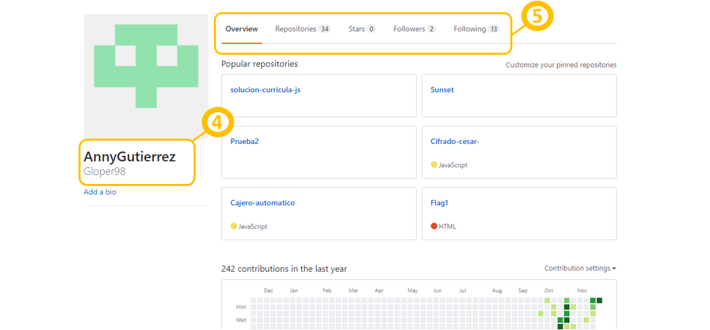

4. **Nombre de la pagina.**
5. **Navegacion local.**

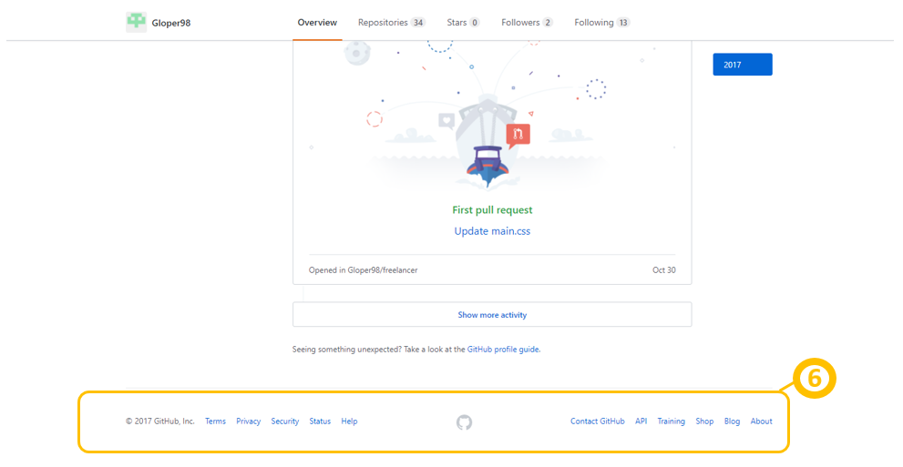

6. **Navegacion de pie de pagina**

## Medium
>[Medium](https://medium.com/) es una nueva red social que nació hace tiempo y funcionaba de manera cerrada. Si bien todos podían entrar y leer los contenidos que estaban en el sitio, solo algunos podían escribir allí. Sea como sea, eso cambió y ahora ya está abierto para todos.

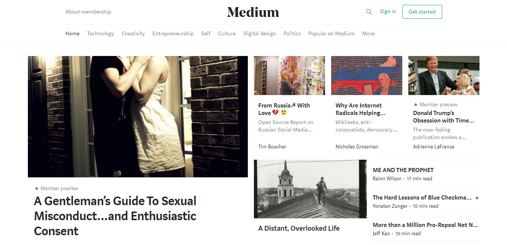
---------------------------------------------------------------------------------------------------------------------------------------

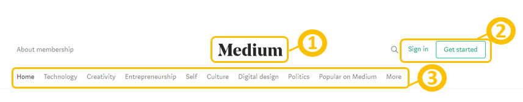

1. **Identificacion del sitio.**
2. **Utilidades**
3. **Secciones(Barra de menu).**

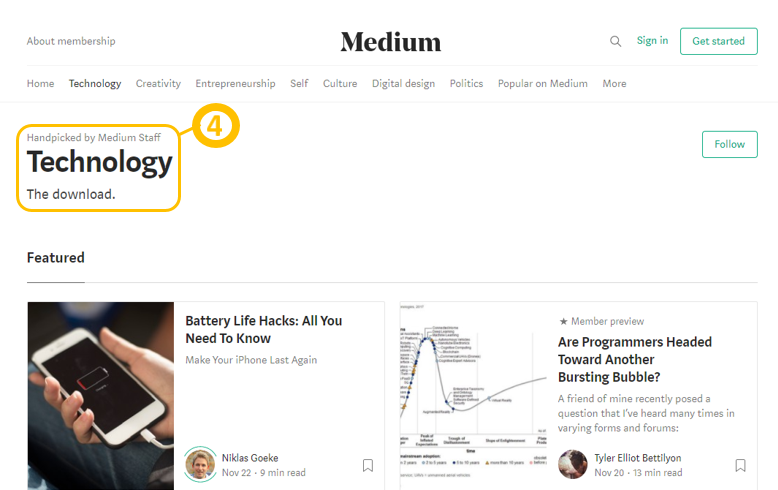
----------------------------------------------------------------------------------------------------------------------------------------
----------------------------------------------------------------------------------------------------------------------------------------
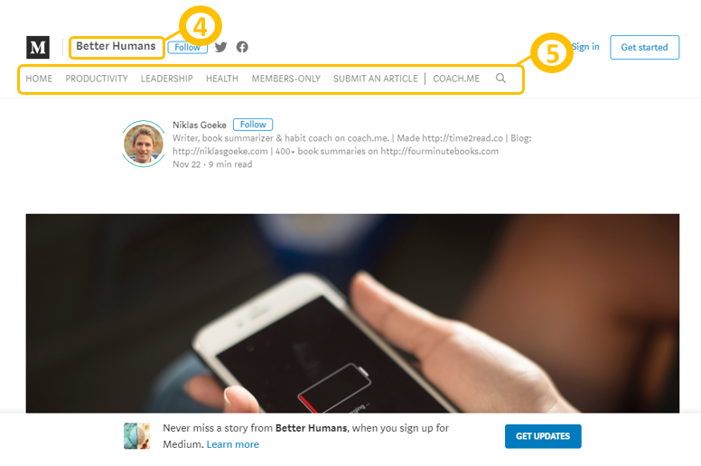

4. **Nombre de la pagina.**
5. **Navegacion local.**

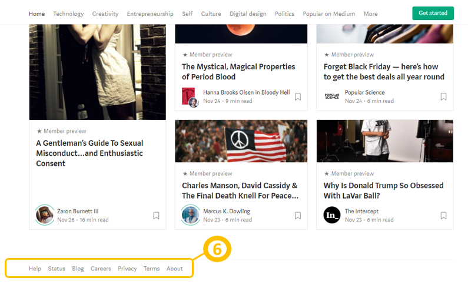

6. **Navegacion de pie de pagina**

