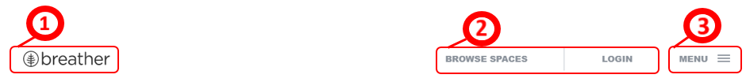

#  Reto dos: Elementos de navegacion
 Identifica los elementos de navegación en los siguientes sites:

*  **Breather**
*  **Github**
*  **Medium**

## Breather
>[Breather](https://breather.com) es una compañia que facilita transacciones entre consumidores y gente que renta espacios para vivir. La compañia se promueve a si misma como el camino para encontrar un ambiente para descansar fuera de tu casa u oficina. The Next Web se refiere a ella como "El uber de los espacios de trabajo privado".

--------------------------------------------------------------------------------------------------------------------------------------------
--------------------------------------------------------------------------------------------------------------------------------------------
--------------------------------------------------------------------------------------------------------------------------------------------

